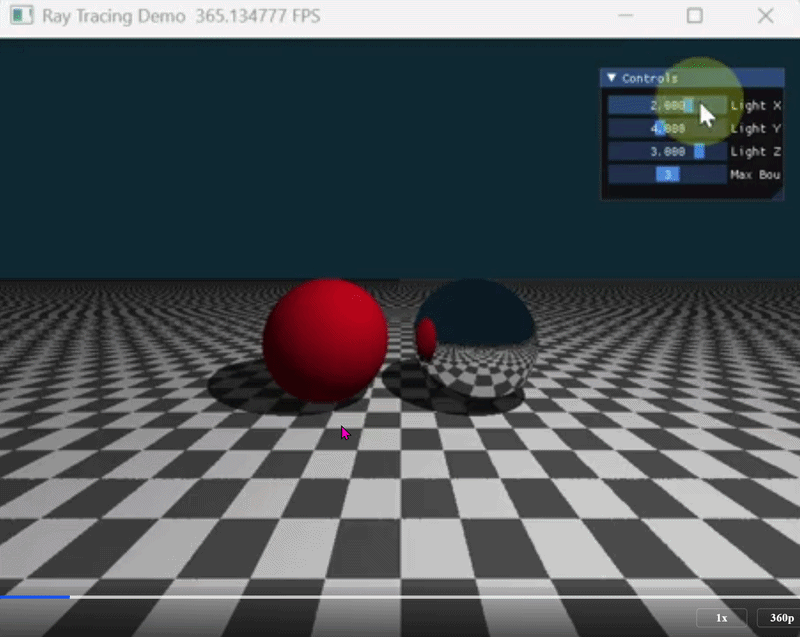

这是一个为您定制的正式版 GitHub 仓库 `README.md` 模板。排版和行文风格与上一份保持一致，去除了多余的修饰，强调了实验的工程化特征与学术规范。

---

# 计算机图形学实验：光线追踪 (Ray Tracing)

本项目为计算机图形学课程实验代码仓库，基于 Taichi 编程语言在 GPU 端实现了一个经典的 Whitted-Style 全局光照光线追踪器。本项目重点解决了光线递归弹射的 GPU 迭代化改写以及阴影自相交等经典图形学问题。

**课程主页：** https://zhanghongwen.cn/cg
**授课教师：** 张鸿文  |  **助教：** 张怡冉  
**学生姓名：** [刘美琪]  |  **学号：** [202411081108]

## 1. 渲染结果展示



## 2. 实验目标与系统特性

本实验摆脱了单纯的光线投射（Ray Casting），通过引入次级射线（Secondary Rays）实现了场景的全局光照效果，包括硬阴影与理想镜面反射。

### 2.1 核心特性 (Core Features)
- **隐式几何体与材质系统**
  - **无限大平面 (Ground Plane)**: 位于 `y = -1.0`，法线朝上 `(0, 1, 0)`。通过计算交点坐标的奇偶性，以程序化生成（Procedural）的方式实现了黑白棋盘格纹理，设定为漫反射材质。
  - **红色漫反射球 (Red Diffuse Sphere)**: 位于左侧 `(-1.5, 0.0, 0)`，半径 `1.0`，设定为纯漫反射材质。
  - **银色镜面球 (Silver Mirror Sphere)**: 位于右侧 `(1.5, 0.0, 0)`，半径 `1.0`，设定为理想镜面反射材质。
- **基于迭代的 GPU 光线弹射 (Iterative Ray Bouncing)**
  - 弃用 CPU 传统的递归光线追踪，采用适合 GPU 并行架构的 for 循环迭代模式。
  - 引入光线吞吐量 (`throughput`) 概念，累加最终颜色 (`final_color`)，支持光线在场景中的多次镜面弹射。
- **硬阴影生成 (Hard Shadows)**
  - 针对漫反射物体，通过向光源方向发射暗影射线进行遮挡测试，实现物理规律正确的硬阴影投射。
- **实时交互控制 (UI Interaction)**
  - 借助 `ti.ui.Window` 模块，提供交互面板以实时调节以下参数：
    - `Light X / Y / Z`: 动态调节光源三维坐标，观察阴影的实时物理反馈。
    - `Max Bounces` (最大弹射次数): 范围 `1 ~ 5`。可直观对比单次反弹（无镜中画面）与多次反弹（生成镜中世界）的区别。

## 3. 环境配置与运行说明

### 3.1 依赖安装
本项目运行环境需配置 Python 3，并确保安装了 Taichi 计算库：
```bash
pip install taichi
```

### 3.2 运行程序
在终端中进入项目根目录，执行以下命令启动光线追踪渲染视窗：
```bash
python main.py
```

## 4. 关键技术与实现细节

为保证光线追踪渲染的准确性与程序的鲁棒性，核心着色代码对以下关键技术细节进行了处理：

1. **GPU 迭代化光线追踪框架**:
   根据反射定律 $\mathbf{R} = \mathbf{L}_{in} - 2(\mathbf{L}_{in} \cdot \mathbf{N})\mathbf{N}$。由于 GPU Kernel 不支持深度递归调用，系统使用固定次数的循环模拟递归路径。当射线击中镜面物体时，更新起点和方向向量，衰减 `throughput` 并进入下一次循环；当射线击中漫反射物体时，计算当前光照颜色乘以 `throughput` 并累加至 `final_color`，随后通过 `break` 提前终止该光线路径。
2. **防自相交机制 (Shadow Acne Prevention)**:
   在生成反射射线与暗影射线时，浮点数计算精度误差会导致新射线的起点直接被判定为与当前物体表面相交，从而在表面生成大面积的黑色噪点（即 Shadow Acne Bug）。为此，系统在生成次级射线时，严格将射线起点沿表面法线 $\mathbf{N}$ 方向偏移了一个微小标量 $\epsilon$（如 `1e-4`）：
   $$\mathbf{P}_{new} = \mathbf{P} + \mathbf{N} \times \epsilon$$
   此处理成功避免了射线的自相交错误。
3. **程序化纹理计算 (Procedural Checkerboard)**:
   对于无限大平面的黑白棋盘格纹理，未引入外部图片采样，而是通过提取交点三维坐标的 `x` 和 `z` 分量，利用 `floor` 或取余运算构建网格索引，通过判断索引之和的奇偶性来交替赋予黑白颜色，极大地降低了内存开销并保证了无限分辨率。
