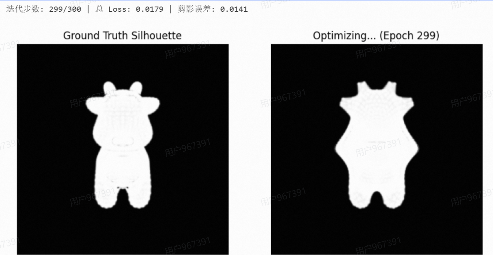

# 计算机图形学实验：可微渲染 (Differentiable Rendering)

本项目为计算机图形学课程实验代码仓库，基于 `PyTorch` 与 `PyTorch3D` 框架实现了一个 3D 网格可微渲染与逆向优化系统。本项目通过多视角二维图像（剪影/RGB）反推三维空间几何，利用梯度下降算法成功将初始的“球体”网格渐进优化重构为目标“奶牛”网格。

**课程主页：** https://zhanghongwen.cn/cg
**授课教师：** 张鸿文  |  **助教：** 张怡冉  
**学生姓名：** [刘美琪]  |  **学号：** [202411081108]

## 1. 渲染与优化结果展示




## 2. 实验目标与核心原理

本实验旨在探索通过 2D 图像逆向推导 3D 几何的深度学习图形学技术，核心解决传统光栅化不可微导致的“梯度消失”以及网格形变过程中的“拓扑崩坏”问题。

### 2.1 软光栅化防梯度消失 (Soft Rasterization)
在传统渲染（硬光栅化）中，像素包含在三角形内部或外部呈现阶跃变化，这会导致边界处的梯度为 0，使得网络无法计算顶点更新的方向。
本系统采用了软光栅化技术，通过计算像素到三角形边缘的距离 $d$，并利用 Sigmoid 函数在边界处产生平滑的概率过渡：
$$A(d) = \text{sigmoid}\left(\frac{d}{\sigma}\right)$$
其中 $\sigma$ 控制边缘的模糊程度。该机制确保了即使顶点在像素外部，也能提供微小但非零的有效梯度，引导源网格顶点向目标形状移动。

### 2.2 网格正则化防局部最优 (Mesh Regularization)
仅依靠图像差异 (Silhouette Loss) 驱动顶点移动，会导致顶点为迎合二维投影而发生严重的交叉与重叠（即形成“刺猬”状的拓扑崩坏）。为保持 3D 网格的光滑性和物理合理性，系统引入了三种正则化损失函数：
- **拉普拉斯平滑 (Laplacian Smoothing)**: 约束相邻顶点，防止表面出现尖锐突起。
- **边长一致性 (Edge Length Penalty)**: 惩罚过长或过短的边，防止网格三角形发生严重的非均匀拉伸。
- **法线一致性 (Normal Consistency)**: 约束相邻三角形面的法线方向，维持表面的整体平滑度。

最终优化使用的总损失函数定义为：
$$L_{total} = L_{silhouette} + w_{lap}L_{lap} + w_{edge}L_{edge} + w_{normal}L_{normal}$$

## 3. 系统流程与实现细节

1. **场景与相机初始化**: 在三维空间中均匀布置多个摄像机视角。加载目标网格（Target Mesh, 奶牛）并渲染出多视角的参考剪影图 (Silhouettes)。
2. **源模型构造**: 初始化一个具有较高细分等级的球体网格（Source Mesh），并将其顶点偏移量矩阵 `deform_verts` 设定为可微参数 (`requires_grad=True`)。
3. **可微渲染管线构建**: 利用 `PyTorch3D` 构建软剪影光栅化器 (`SoftSilhouetteShader`)。
4. **迭代优化**:
   - 在每个 Epoch 中，基于当前 `deform_verts` 计算形变后的球体剪影。
   - 计算当前剪影与目标剪影的均方误差 (MSE Loss)。
   - 叠加上述提及的三种网格正则化惩罚项。
   - 使用 `Adam` (或 `SGD`) 优化器反向传播并更新顶点偏移量。

## 4. 环境配置与运行说明

### 4.1 依赖安装
本项目依赖底层的 CUDA/C++ 算子，需严格配置 PyTorch 环境。推荐使用 Conda 进行安装（macOS 用户可配置基于 Apple Silicon 的兼容版本）：
```bash
# 1. 安装 PyTorch 与 TorchVision (请根据您的 CUDA 版本调整)
conda install pytorch torchvision torchaudio pytorch-cuda=11.8 -c pytorch -c nvidia

# 2. 安装 PyTorch3D
conda install -c fvcore -c iopath -c conda-forge fvcore iopath
conda install -c pytorch3d pytorch3d
```

### 4.2 运行程序
在终端中执行以下命令启动优化脚本：
```bash
python optimize_mesh.py
```
