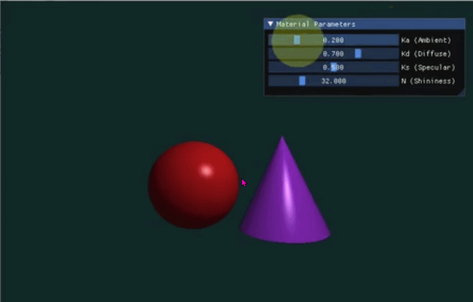

# 计算机图形学实验：Phong 光照模型 (Phong Lighting Model)

本项目为计算机图形学课程实验代码仓库，基于 Taichi 编程语言实现了一个实时交互式光线投射 (Ray Casting) 与 Phong 光照模型渲染系统。

**课程主页：** https://zhanghongwen.cn/cg
**授课教师：** 张鸿文  |  **助教：** 张怡冉  
**学生姓名：** [刘美琪]  |  **学号：** [202411081108]

## 1. 渲染结果展示

*(请在此处替换为您本地运行程序的截图或录制演示)*


## 2. 实验目标与系统特性

本项目不依赖外部 3D 模型文件，在 Taichi Kernel 中利用数学方程隐式定义几何体，并通过光线投射算法进行像素级渲染与着色。

### 2.1 核心特性 (Core Features)
- **隐式几何体光线求交 (Ray Casting)**
  - **红色球体**: 圆心坐标 `(-1.2, -0.2, 0)`，半径 `1.2`，基础颜色 `(0.8, 0.1, 0.1)`。
  - **紫色圆锥**: 顶点坐标 `(1.2, 1.2, 0)`，底面高度 `y = -1.4`，底面半径 `1.2`，基础颜色 `(0.6, 0.2, 0.8)`。
- **深度测试 (Depth Testing)**
  - 实现了基于射线求交距离 $t$ 的深度竞争逻辑。当射线同时击中多个几何体时，选取距离摄像机最近的交点（最小正数 $t$）进行着色，确保了正确的空间遮挡关系。
- **Phong 着色器 (Phong Shader)**
  - **环境光 (Ambient)**: $I_{ambient} = K_a \times C_{light} \times C_{object}$
  - **漫反射 (Diffuse)**: 遵循 Lambert 定律，与光线入射角的余弦值成正比。
  - **镜面高光 (Specular)**: 模拟光滑表面的镜面反射。
- **实时交互控制 (UI Interaction)**
  - 集成 `ti.ui.Window` 模块，提供侧边栏滑动条，支持对以下材质参数进行实时调节与渲染反馈：
    - `Ka` (环境光系数): 范围 `0.0 ~ 1.0`
    - `Kd` (漫反射系数): 范围 `0.0 ~ 1.0`
    - `Ks` (镜面高光系数): 范围 `0.0 ~ 1.0`
    - `Shininess` (高光指数): 范围 `1.0 ~ 128.0`

### 2.2 选做特性 (Bonus Features)
*(注：根据实际完成情况保留或删除以下条目)*
- **Blinn-Phong 模型升级**: 引入半程向量 $\mathbf{H}$ 进行高光计算，优化了大入射角下的边缘高光表现。（*详见下方实验分析*）
- **硬阴影 (Hard Shadow)**: 实现了次级射线（Shadow Ray）的发射与求交检测，当光源被遮挡时，该像素仅计算 Ambient 分量，实现了物理正确的硬阴影效果。

## 3. 环境配置与运行说明

### 3.1 依赖安装
本项目运行环境需配置 Python 3，并安装 Taichi 库：
```bash
pip install taichi
```

### 3.2 运行程序
在终端中进入项目根目录，执行以下命令启动实时渲染窗口：
```bash
python main.py
```

## 4. 关键技术与实现细节

在着色器的实现过程中，严格遵循了以下图形学数学规范，以确保渲染结果的正确性：
1. **向量归一化 (Normalization)**: 参与光照点乘计算的光线方向向量 $\mathbf{L}$、视线方向向量 $\mathbf{V}$ 以及表面法向量 $\mathbf{N}$ 均使用了 `.normalized()` 处理。这避免了因向量长度非 1 导致的渲染全黑或乱码问题。
2. **负值截断 (Negative Truncation)**: 在计算漫反射和镜面高光时，应用了 `ti.max(0.0, dot_product)` 对点乘结果进行负值截断，有效防止了背面光照计算导致的黑色噪点与非法溢出。
3. **颜色钳制 (Color Clamping)**: 为防止多个光照分量叠加后 RGB 数值超过最大值 1.0 而导致画面过曝发白，在写入帧缓存前使用了 `ti.math.clamp(color, 0.0, 1.0)` 将最终颜色严格限制在合法物理区间内。
